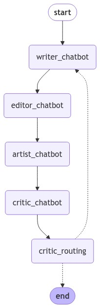
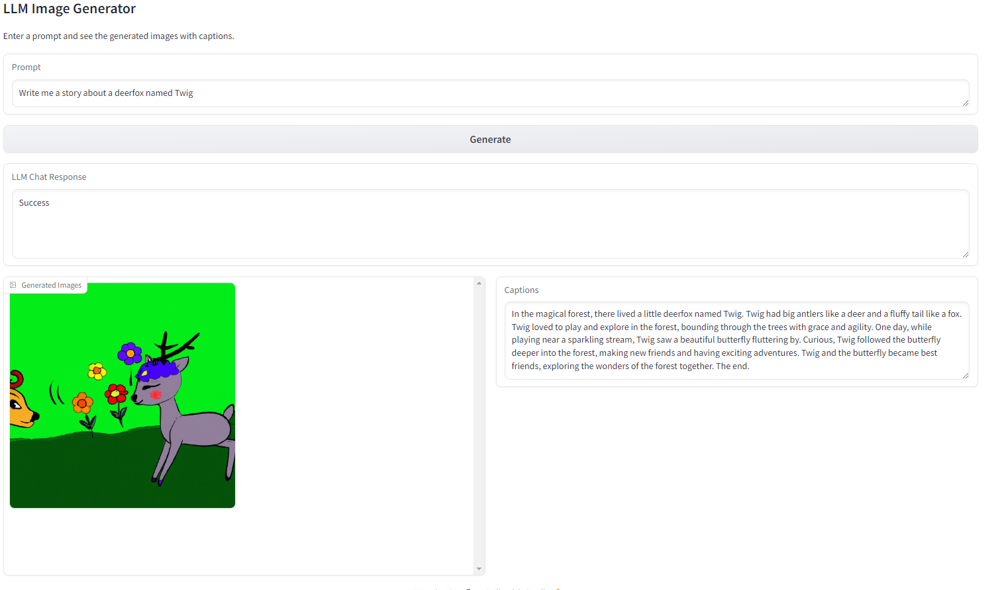

# Simple Childrens Story Generator Graph
* Goal to prototype something simple to get more experience with agentic application,s foundation models, tool usage, LangGraph and related tools
* Based on a user prompt:
    * A writer agent generates a short childrens story
    * The story is sent to an editor agent
    * The editor revises the story and sends to an artist agent
    * The artist generates an image
    * The critic agemt reviews the work and either approves (goes to human) or sends back to the writer
* Interaction is a Gradio interface
* Complete for now. May revisit elements of this in a future project.

## Graph

## Example Output

